# bright-belonging
🌈 Bright Belonging — Sensory-Inclusive Guidance for Parents & Teachers

Bright Belonging is a fictional educational website designed to help parents, teachers, and caregivers understand and support the sensory needs of children in inclusive environments. This repository contains the source code, content, and design assets for the site.

<h2>⭐ Primary Goal </h2>

Bright Belonging aims to make sensory inclusivity accessible and easy to understand. The platform provides clear, research-informed guidance so adults can create environments where every child feels safe, supported, and able to thrive.

<h3>Business Goal </h3>

Showcase the resources avaliable
Provide essential information
Equip adults with practical, evidence-informed tools
Promote awareness and inclusion
Encourage group visits + event participation
Support inclusive educational practices for all children

<h2>User Personas </h2>

[ ] As a young person with sensory differences I want clear explanations of sensory terms and self‑help tools so that I can better understand and communicate my needs.

[ ] As a parent I want to find local support groups, therapists and events near me so that I can build a local network of help.

[ ] As a classroom teacher I want downloadable lesson plans and activity modifications so that I can include students with sensory needs easily.

<h3> User stories <h3>

<h2>UXP design choices </h2>

The completed 3 day sprint was composed of X separate items taken from business goal and user personas. Having used the MoSCoW approach to prioritisation, a Kanban board was created. X issues were classified as "Must-Have" making up less than 60% of the tasks as recommended. The rest of the first sprint was made up of "Should-Have" and "Could-Have" items. There were ___ remaining backlog items.

<h3>Wire frame designs</h3>
phone=
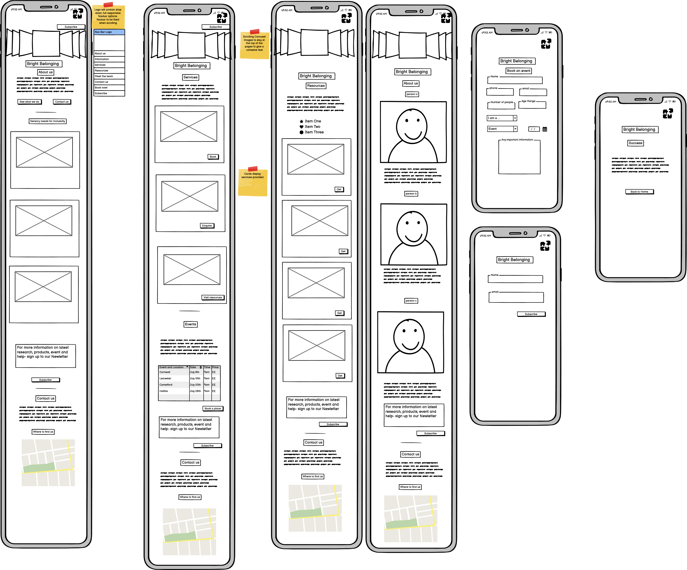 
Mediumn screens and tablets=

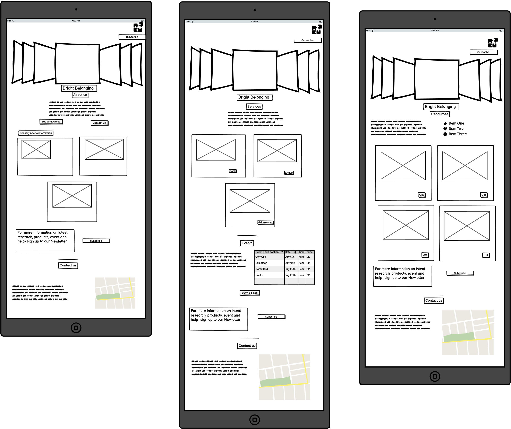

Desktops and large screens=

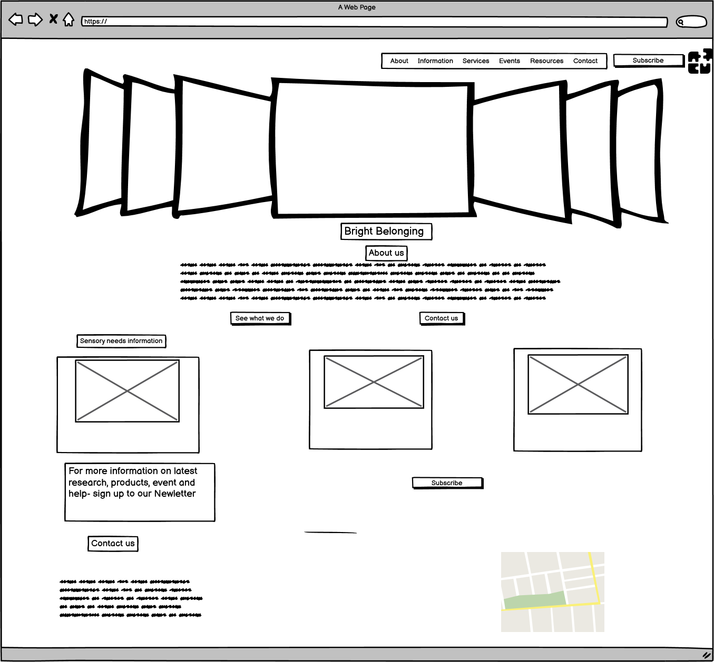

The site layout will look like this
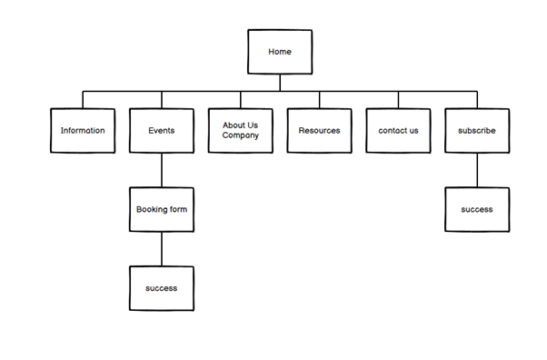

<h3>Colour pallette</h3>

Color pallette selected and check for WCAG standards to ensure accessibility.
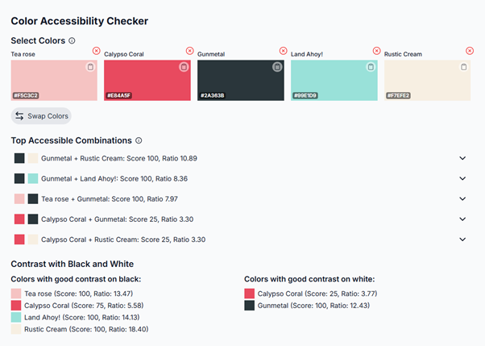
Checked with https://colorlabs.net/ 

<h3>Fonts</h3>

<h2>Features </h2>

<h3> Home page </h3>
Homepage showing;
-nav bar, subscribe button in prominant place with clear accessible colours and high quality images.
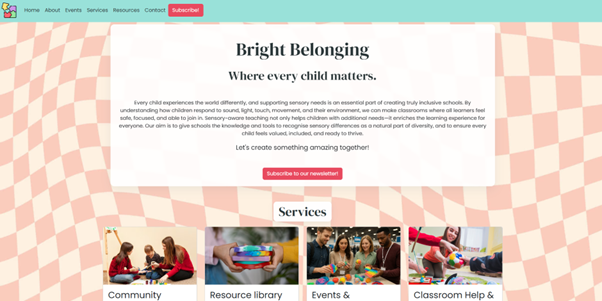
Clearly defined Events in a table with map location and booking form button.
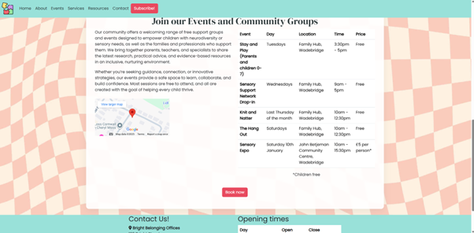
Booking form button will lead to form page
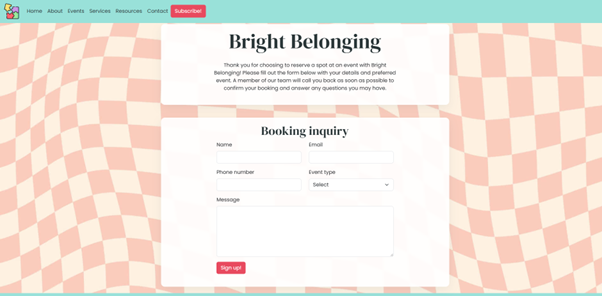
Which when completed will lead to a "Success page"
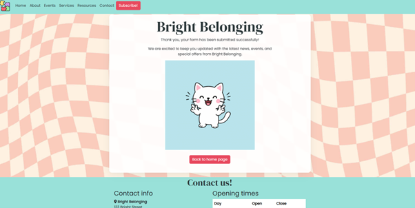
About with cards shoing strategies for different possible difficulties children may face.
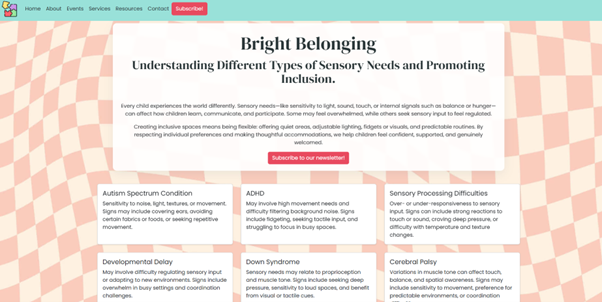
Resources Page

Footer with clear contact information which appears on all pages.

Finally, a modal pop up which also links to the success page which the subscribe button is clicked.

<h2> Testing </h2>
<h3>Reponsive tesing </h3>

 Alongside the built in Bootstrap responsive CSS, Chrome dev tools were used frequently to test the site at standard screen sizes and the site was manually viewed on laptops, tablets and phones. 

<h3>Lighthouse testing</h3>

Light house performace testing showed 99 rating

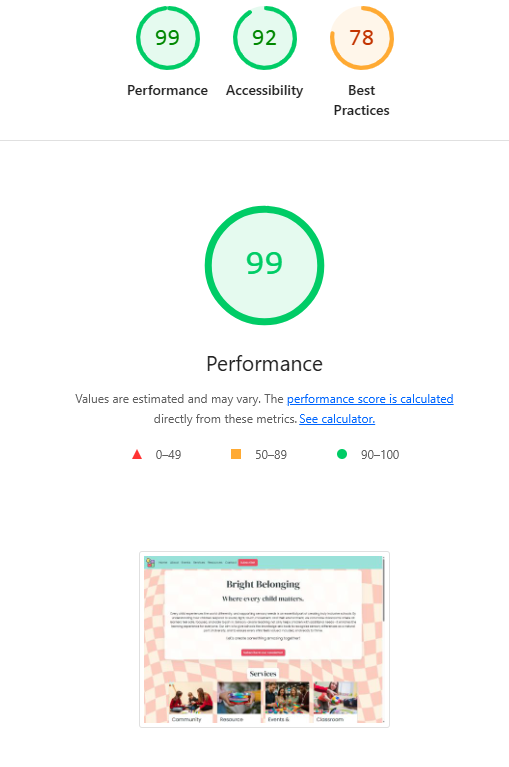
The low score when checked for Best practises was because third party sources were used- ie-google maps.
<h3>Validator testing </h3>
html. css, 
<h2> Deployment</h2>

Hosted on GitHub Pages.
Version controlled with GitHub.
Static-only (no backend required)..

